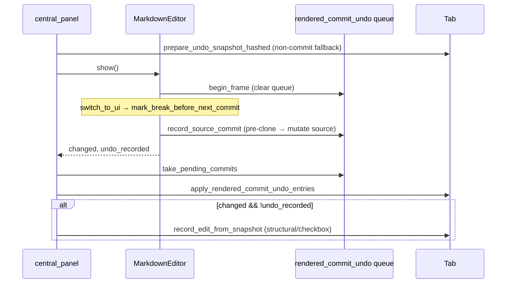

# Rendered Edit Session — Undo Granularity

Block commits in rendered WYSIWYG mode produce **one logical undo step** per close/switch/save, not one step per in-session keystroke.

**Modules:** `src/markdown/rendered_commit_undo.rs`, `src/markdown/editor.rs` (`commit_session_block`), `src/state.rs` (`Tab::apply_rendered_commit_undo_entries`)

## Problem

`central_panel` previously called `prepare_undo_snapshot_hashed()` each frame and `record_edit_from_snapshot()` when `MarkdownEditorOutput.changed`. Session buffers keep keystrokes out of tab source until commit, but any path that wrote source mid-frame could still record per-keystroke undo if it ran every frame.

## Commit boundary

Undo is recorded when source is mutated at a **commit boundary**:

| Event | Undo step |
|-------|-----------|
| `RenderedEditSession::close_active` / `switch_to` with `SaveIfDirty` | Yes — via `commit_session_block` |
| Enter / lost focus on session TextEdit | Yes — closes active block |
| Click outside active block (`session_dismiss_if_clicked_outside`) | Yes |
| Table cell flush (`EditableTable` `output.changed`) | Yes — one step per table write |
| Keystrokes in active session buffer (`on_text_changed`) | **No** |
| Task checkbox toggle, structural edits | Yes — fallback in `central_panel` when `!undo_recorded` |

## Flow



1. **`record_source_commit`** clones source immediately before mutation and enqueues `PendingRenderedCommitUndo`.
2. **`session_switch_to_ui`** calls `mark_break_before_next_commit` so the previous block's commit starts a fresh undo group.
3. After `show`, **`Tab::apply_rendered_commit_undo_entries`** sets `pending_undo_snapshot` from each pre-commit clone and calls `record_edit_from_snapshot()` (no `source_epoch` bump — rendered policy).
4. **`MarkdownEditorOutput.undo_recorded`** prevents duplicate recording for commits; structural/checkbox paths still use the frame-start snapshot + fallback `record_edit_from_snapshot`.

## Table cells

`BlockRef::TableCell` commits only signal `signal_table_force_commit`; the actual source write and undo enqueue happen in `render_table` when `EditableTable` sets `output.changed`.

## Undo / redo and epoch

`Tab::undo()` / `redo()` bump `source_epoch` and invalidate session buffers via `load_for_epoch`. Rendered commits do **not** bump epoch during normal editing (stable widget ids).

## Related

- [Core session](./rendered-edit-session-core.md)
- [EditHistory](../editor/edit-history.md)
- [Undo/redo](../editor/undo-redo.md)
- [Split view](./rendered-edit-session-split-view.md)
- [Phase 0 epoch policy](./rendered-edit-session-phase0.md)

## Tests

```bash
cargo test rendered_commit_undo::
cargo test rendered_session::
```
