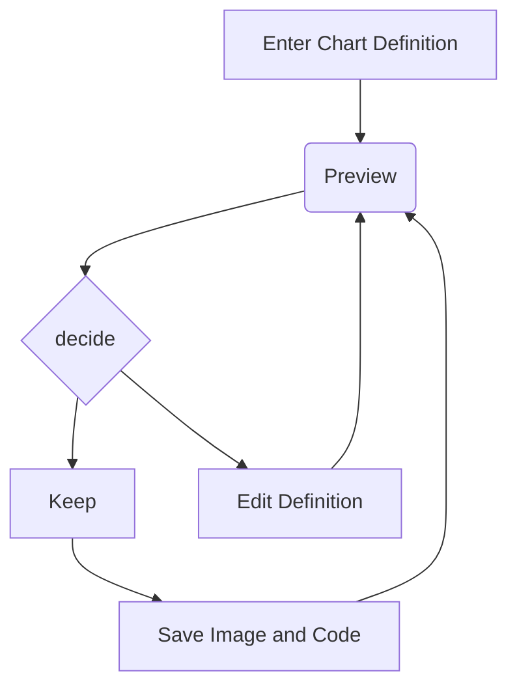
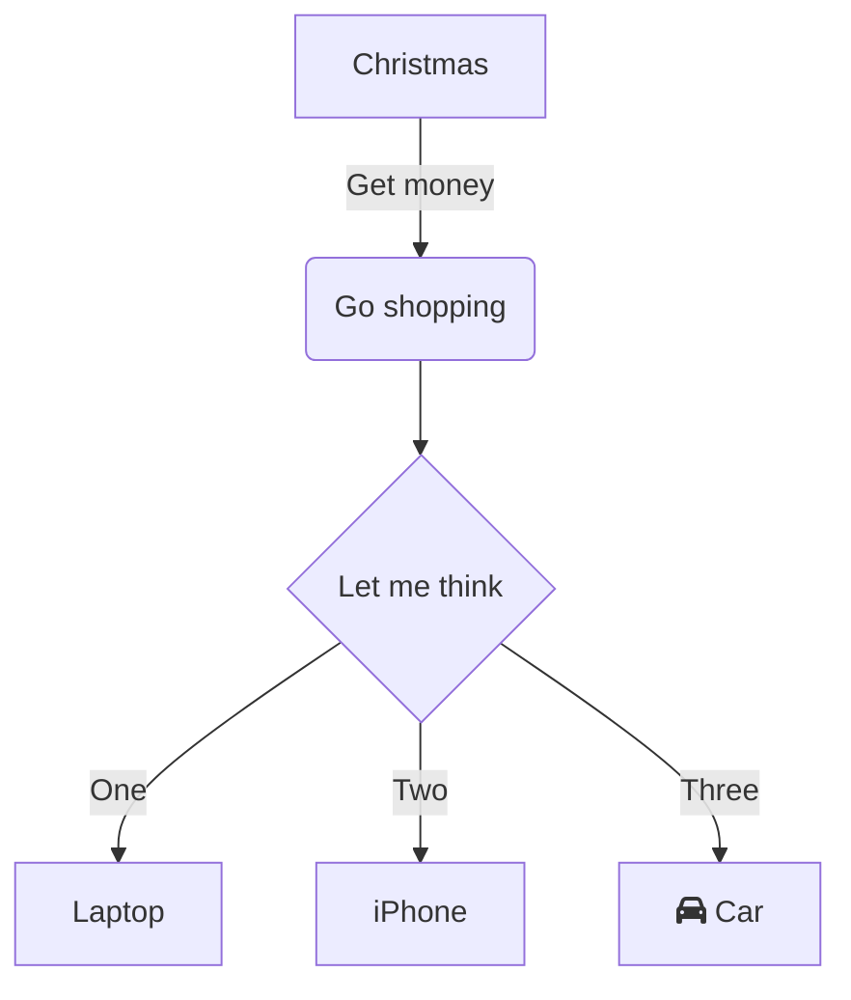

# Mermaid Issue #83 — Edge Routing Repros

GitHub: [#83 — Mermaid rendering: lines cross boxes](https://github.com/OlaProeis/Ferrite/issues/83)

Open in **Rendered** or **Split** view and compare to [Mermaid Live Editor](https://mermaid.live).

## FC-83a — Feedback loop (linkStyle interpolate)s

**Expected (Mermaid.js):** Edges route around nodes; loops use smooth curves; no line segments through box interiors.

**Known Ferrite gaps:**

- Edges may pass **through** node rectangles (especially `E --> B`, `F --> B`).
- `interpolate basis` is **ignored** (only `stroke` / `stroke-width` supported in `linkStyle`).

---

## FC-83b — Shopping flowchart (Font Awesome icon)

**Expected (Mermaid.js):** Car icon + label on node F; edges do not cross unrelated nodes.

**Known Ferrite gaps:**

- `fa:fa-car` prefix is **not** rendered as an icon (raw text or stripped label only).
- Same class of edge routing issues on dense graphs.

---

## Pass criteria (pre-0.3.0 Mermaid rendering goal)

- [ ] No edge segment intersects a node rect it does not start/end on (FC-83a).
- [ ] Back-edges use curved paths that clear node bounds (FC-83a).
- [ ] Node F label readable without raw `fa:` prefix (FC-83b) — icon optional.
